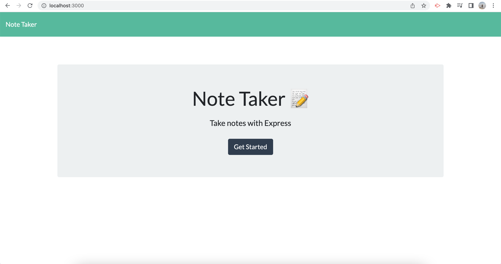
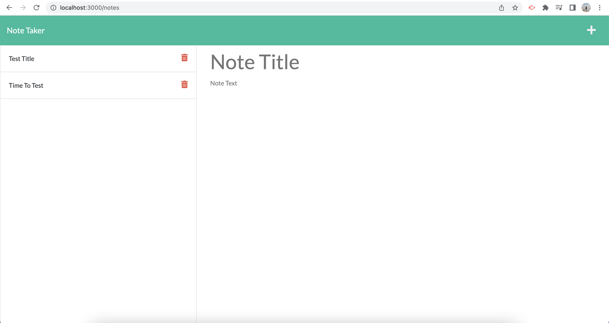
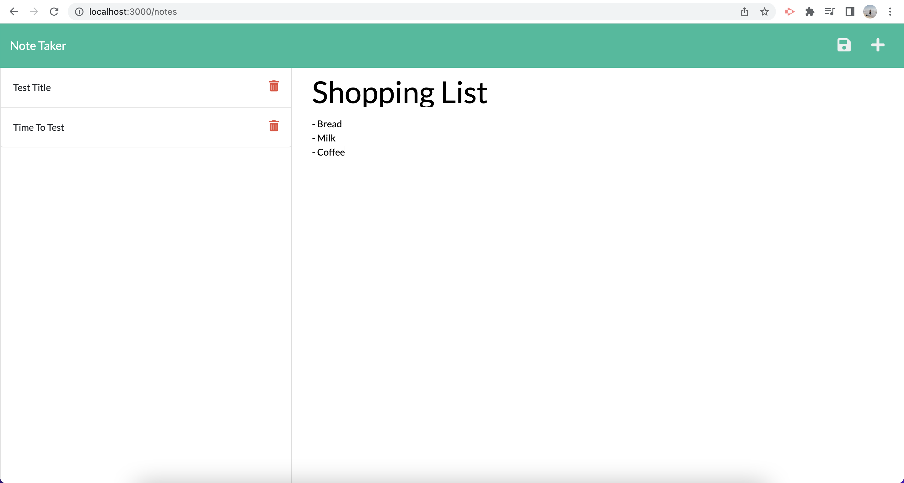
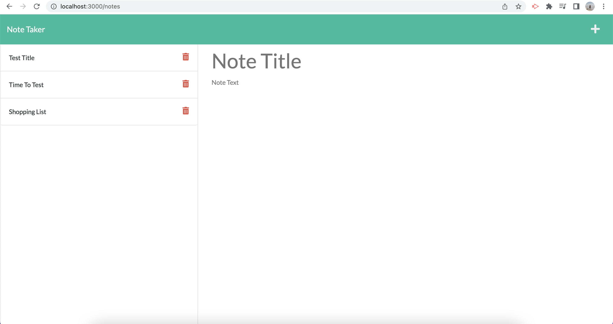

# noteTaking2.0

## Description
I have created this app to write down notes and save them so that I can refer back to them in the future. Almost like a todo list or to simply share what i'm thinking. If you make a mistake or no longer need the note you can also delete it.
Once the notes are saved the data will be stored as a JSON file that is in the repository.
I have used Expressjs and uuid to create this app. 

## Installation
To install make sure you have node.js installed on your computer, then simply clone repository and run 
```md 
npm install 
```
in your cli to add the dependencies express.js

## Usage

Once all dependancies are added, then run
```md
npm start
```
in your CLI to start the server then go to your browser and type in
```md
http://localhost:3000/
```
Into the search bar.

You will then be greeted by the folling screen.
 
Next, click the "Get Started" button and you will be taken to a page that has saved notes on the left of page and an area to write a new not on the left that looks like the following. 

If you would like to write a new note just click on the writing that says Note Title and start typing your replacement text and if you would like to add a note text you can do the same thing by clicking on the Note Text section and start typing. Example below.

Once you have completed your note and want to save it. Just click the "floppy disk" icon on the top right corner of the page and your note will be saved on the right hand side and data will be stored in your db JSON file.

If you would like to add more than one note simply repeat the process.

## Link
This is a link to the <a href="https://stormy-mesa-25003.herokuapp.com/">Deployed App</a>

## Questions
If you have any questions related to this repository you can find my contact details via my <a href="https://github.com/skipsterling">GitHub</a> account.